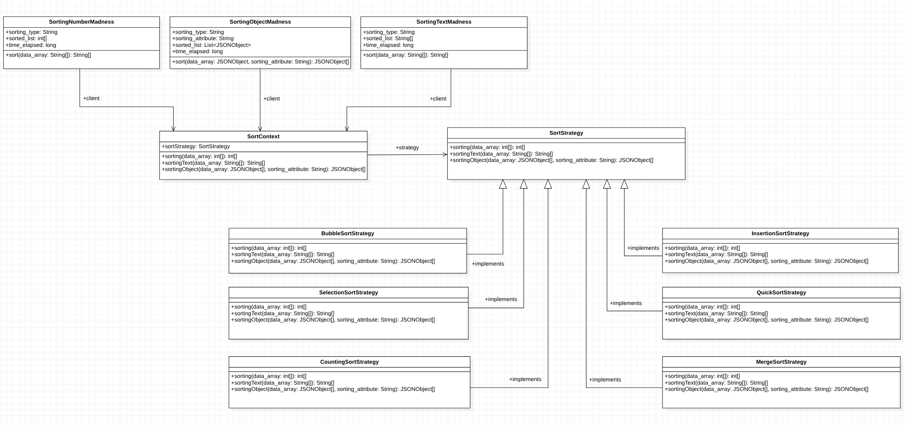

<h1 align="center">
    Sorting Madness 7️⃣
</h1>

 

_Dostępne również w wersji po: [English](README.md)_

## O projekcie

Sorting-Madness projekt w ramach przedmiotu Inżynieria Oprogramowania na Politechnice Poznańskiej.
Aplikacja pozwala na posortowanie wprowadzonych przez użytkownika danych 6 różnymi algorytmami 
sortowania używająć REST API i porównanie ich czasów sortowań. Dane liczbowe są sortowane standardowo, natomiast 
tekstowe - leksykograficznie. Wzorzec projektowy Strategia został zaimplementowany w celu 
wymiennego korzystania z różnych algorytmów sortowania w trakcie działania aplikacji, 
schemat wzorca prezentuje poniższy diagram [UML](https://en.wikipedia.org/wiki/Unified_Modeling_Language).



Celem projektu było poznanie metodyki zarządzania projektem [Scrum](https://en.wikipedia.org/wiki/Scrum_(software_development))
([Sprint](https://docs.google.com/spreadsheets/d/e/2PACX-1vTn6j3M8pmGEzrsQk8mXse7lVHUdhYWkfxbkQiYI23rBtwM4N3bWw0qtupW-gesfCkcYasnZ-eEXl-F/pubhtml)
, [Product Backlog](https://docs.google.com/spreadsheets/d/1MwBEK283qNdv1wkT7OfIPgs4_kbdy4gXljwIPXqAN7Y/edit#gid=1176682582)) 
i zaimplementowanie aplikacji REST API [Java](https://www.java.com/) [Spring Boot](https://spring.io/projects/spring-boot) 
z wykorzystaniem [Mavena](https://maven.apache.org/). Dodatkowo stworzona została dokumentacja [Javadoc](https://en.wikipedia.org/wiki/Javadoc), 
zaimplementowano wzorzec projektowy [Strategia](https://pl.wikipedia.org/wiki/Strategia_(wzorzec_projektowy)) i przeprowadzono testy przy 
pomocy biblioteki [JUnit](https://junit.org/junit5/).

## Uruchamianie

Projekt korzysta z Mavena, dlatego w celu uruchomienia go z terminala, wystarczy skorzystać z polecenia
`mvn spring-boot:run`, a następnie używając adresu http://localhost:8080 wysyłać żądania GET i POST w celu sortowania danych.

Możliwe jest również skorzystanie z wdrożonej wersji pod adresem https://sorting-madness.herokuapp.com/ lub
zaimportowanie projektu do IDE według uznania, ponieważ projekt korzysta z Mavena.

## Jak korzystać?

### Metoda GET

```
http://localhost:8080/<lista algorytmów sortowania>/?numbers=<lista wartości numerycznych>
http://localhost:8080/insertion,bubble,merge/?numbers=5,4,3,2,1,4,2,5,6
```

```
http://localhost:8080/text/<lista algorytmów sortowania>/?strings=<lista slow>
http://localhost:8080/text/insertion,bubble,merge/?strings=kota,ma,ala
```
### Metoda POST

```json
{
  "sortingTypes": ["insertion", "bubble", "merge"],
  "data": [5, 4, 3, 2, 1]
}
```

```json
 {
  "sortingTypes": ["quick", "bubble", "insertion"],
  "data": ["d", "e", "c", "b", "a"]
}
```

```json
 {
  "sortingTypes": ["bubble", "quick", "insertion"],
  "data": [
    {
      "a": 1,
      "b": 5,
      "c": "c"
    },
    {
      "a": 3,
      "b": 4,
      "c": "a"
    },
    {
      "a": 6,
      "b": 2,
      "c": "b"
    }
  ],
  "sortingAttribute": "a"
}
```
